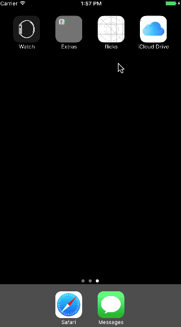

# Project 1 - *Flicks*

**Flicks** is a movies app using the [The Movie Database API](http://docs.themoviedb.apiary.io/#).

Time spent: **16** hours spent in total

## User Stories

The following **required** functionality is completed:

- [x] User can view a list of movies currently playing in theaters. Poster images load asynchronously.
- [x] User can view movie details by tapping on a cell.
- [x] User sees loading state while waiting for the API.
- [x] User sees an error message when there is a network error.
- [x] User can pull to refresh the movie list.

The following **optional** features are implemented:

- [x] Add a tab bar for **Now Playing** and **Top Rated** movies.
- [x] Implement segmented control to switch between list view and grid view.
- [x] Add a search bar.
- [x] All images fade in.
- [x] For the large poster, load the low-res image first, switch to high-res when complete.
- [x] Customize the highlight and selection effect of the cell.
- [x] Customize the navigation bar.

The following **additional** features are implemented:

- [x] Added a home navigation button to allow users quickly navigate from search result view to movie full list\grid view

## Video Walkthrough

Here's a walkthrough of implemented user stories:

GIF created with [LiceCap](http://www.cockos.com/licecap/).

## Notes

It took me a while to understand how scroll view works.
The point of a scroll view is that it displays a virtual content rectangle larger than itself. The size of this virtual rectangle is defined by contentSize.
When the content is fully displayed in the scrolled view, then it can't be scrolled down anymore.

## Credits
Movie Ticket icon - created by b farias from Noun Project

Top Rated ico - created by Randomhero from Noun Project

## License

    Copyright [2017] [LiQiang Ye]

    Licensed under the Apache License, Version 2.0 (the "License");
    you may not use this file except in compliance with the License.
    You may obtain a copy of the License at

        http://www.apache.org/licenses/LICENSE-2.0

    Unless required by applicable law or agreed to in writing, software
    distributed under the License is distributed on an "AS IS" BASIS,
    WITHOUT WARRANTIES OR CONDITIONS OF ANY KIND, either express or implied.
    See the License for the specific language governing permissions and
    limitations under the License.
